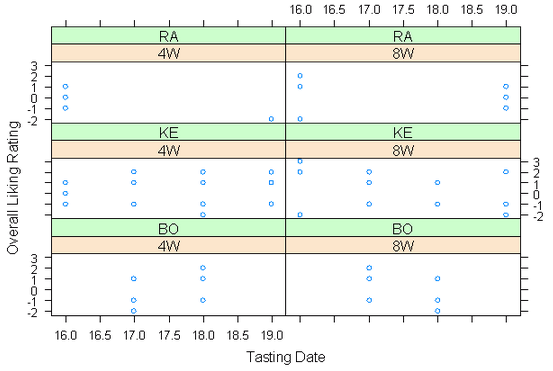
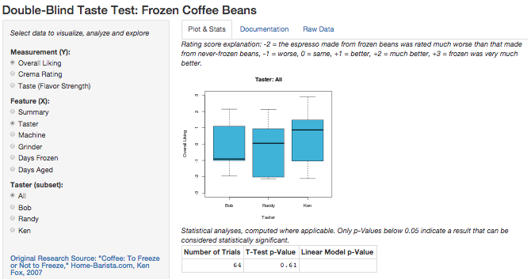

Frozen Coffee Beans, a data exploration tool
========================================================
author: Peter Nelson
date:   2015-04-19

Background
==========
In 2007, Ken Fox from Home-Barista.com, commenced [a carefully designed study](http://www.home-barista.com/store-coffee-in-freezer.html) to answer that question. They performed a series of 64 blind taste tests between espresso made from frozen coffee beans versus espresso made from coffee beans never frozen but otherwise prepared precisely the same way. 
 
For the 64 different blind taste test trials they varied five features: the taster, the length of time the beans were in the freezer, the length of time the beans were out of the freezer/roaster, the espresso machine type, and the grinder
burrs. 
 
They rated each espresso three ways: overall quality, crema quality, and flavor strength. The rating was one a scale of -3 to +3, for espresso being very much worse to very much better when made from frozen beans versus never-frozen beans.

The Problem
===========
The authors presented five pages of explanation as to their test methodology, but concluded rather anti-climactically with a few cryptic charts and a conclusion that there is no stastically significant (anova) difference. Leaving us wondering if more could be said, or discovered.

The Solution
============
Fortunately for us, the study authors generously posted their [raw data](http://www.home-barista.com/store-coffee-in-freezer-details.html) in the original study. This has been loaded into R, and a Shiny App has been built to allow your personal exploration. Some of the "interesting results", hinted at by the study's authors, are discoverable.

Links
=====
- [The Shiny Data Exploration App](https://pbnelson.shinyapps.io/frozenbeans/)
- [The original study](http://www.home-barista.com/store-coffee-in-freezer.html)
